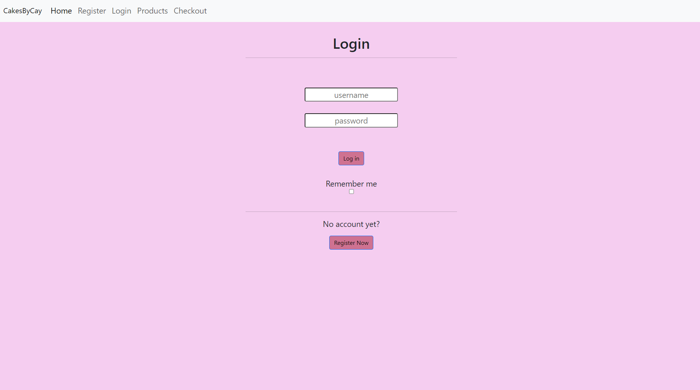

<h1>CakesByCay E-commerce Page</h1>
 
<b>Synopsis</b>
 
 

This page is an E-commerce platform. This website is used for selling cakery items. It features a charming selection of handcrafted desserts, from decadent cakes for every occasion to mouthwatering cookies and chocolate covered treats. This page feartures an easy register and log in form, item names and descriptions.

<b>Technologies used</b>
<li>HTML</li>
<li>CSS</li>
<li>BOOTSTRAP</li>
 
 

This is the home page. It has a short description of our mission statement, what we offer, and what we believe in. My favorite Css feture used was border radious to round off the harsh edges on the photo

 
 

This is the register page. It is designed to be an easy seamless registration htat also asks how you heard about us. My favorite HTML feture used was adding in the radi buttons.

 
 

This is my login page. It fetures an easy log in method, a remember me button, and a link to the register page to create an account. My favorite feture is the register now button, when clicked it redirects you to the register page.

 
 

This is my products page. This page fetures six products, gives a description, shows a price, and has an add to cart button. My favorite feture was adding the cards from bootstrap.

 
 

This is my checkout page. It fetures an easy and safe checkout process, and a area for your items waiting to be purchased. My favorite feture is adding the drop down feture for the states.

